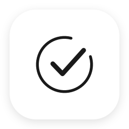

<p align="center"></p>

# Life · OS

**以专项推进，让 Agent 一起把事项整理清楚、拆解到可执行、持续更新进度。**

[English](README.en.md) · [构建与 iCloud](docs/building.md) · [Agent 协作](docs/agent-workflow.md) · [CLI 接口](docs/cli.md) · [MIT](LICENSE)

Life · OS 是面向 macOS 和 iOS 的原生个人执行管理 App。它把长期关注的方向、阶段性专项和具体行动连接起来：先确定正在推进什么，再决定下一步做什么，日期按需安排。

```text
方向：拓展学习
└── 专项：学习一门新语言
    └── 任务：完成第一次主题表达
        ├── 收集表达素材
        ├── 写出初稿
        │   ├── 整理核心观点
        │   └── 补充例子
        └── 录制并回看
```

## 为什么做它

事项往往属于某个长期方向，真正推进的单位则是一个个专项。Life · OS 保留这层关系，让任务和任意深度的子任务围绕同一个目标展开。日历是辅助视图，日期不是收集任务的前提。

人和 Agent 使用同一套任务结构。人可以在 App 里阅读、编辑和安排事项；本地 Agent 可以通过 CLI 查询现状、整理归属、拆分步骤、更新进度。所有写入经过 App 的规则检查，并进入同一份操作历史和 iCloud 同步流程。

## 已有能力

- **方向 → 专项 → 任务 → 多层子任务**，支持展开、折叠、同级拖动排序和整棵任务树移动。
- 任务备注支持富文本与全屏查看，配合进度、状态、标签、优先级和可选日期。
- 今天、未来 7 天、本月、本季度待办视图，按专项分组；首页仍从各个方向开始。
- 本地 CLI 和 JSON 请求接口，支持分类、批量变更、模板、版本冲突检查、幂等重试和历史撤回。
- 配置自己的 Apple 开发者账号后，通过 CloudKit 私有数据库同步 Mac 与 iPhone；设备保留离线副本。
- 任务模板、搜索与筛选、看板、辅助日历、笔记、归档和回收站。
- Mac 快速添加与菜单栏、iOS 分享扩展、Apple 快捷指令。
- 黑白界面、可关闭的轻柔纸纹；普通任务选中不增加填充色。

没有内置模型，也不要求模型 API Key。你可以连接能运行本地命令的 Agent。Agent 的理解和规划来自你选择的工具；App 本身不做自然语言识别。当前不包含提醒、习惯打卡、番茄钟、倒数日、四象限或固定复盘模块。

## 快速开始：本机预览

需要 macOS 和完整 Xcode（包含 Swift 6 工具链；Xcode 16 或更新版本）。如果装有多套 Xcode，请先让 `xcode-select` 或 `DEVELOPER_DIR` 指向要使用的版本。

```sh
git clone https://github.com/Alex-cloud0413/lifeos-app.git
cd lifeos-app
swift test
zsh scripts/build.sh preview
open build/PreviewDerivedData/Build/Products/Preview/Dayline.app
```

Preview 使用独立的本机任务库，不连接 iCloud，也不需要作者的开发者账号。默认不会预填示例任务。界面目前以中文为主。

需要跨设备同步时，按 [构建说明](docs/building.md) 设置自己的 Bundle ID、CloudKit 容器和 App Group。**下载源码不等于获得可在任意设备安装的签名安装包。** 当前公开的是开发版本源码；Mac、iPhone 签名与分发需要自行配置。

## 与 Agent 一起推进

打开 Mac App，在「设置 → 本地 Agent」启用连接，然后使用构建得到的 `build/lifeos`：

```sh
./build/lifeos directions
./build/lifeos projects --direction DIRECTION_ID
./build/lifeos tasks --project PROJECT_ID
./build/lifeos add "收集表达素材" --parent TASK_ID
./build/lifeos update TASK_ID --progress 40 --notes "已完成素材整理；下一步写初稿。"
```

上面的 ID 需替换成查询结果中的完整 ID。自定义签名版本的 CLI 需设置 `LIFEOS_BUNDLE_ID`，或通过 `--socket` 指定连接位置，详见 [Agent 协作示例](docs/agent-workflow.md)。Agent 可以帮助推进事项，但不会自动获得发布文章、发送消息或访问其他账号的权限。

## 项目结构

| 路径 | 内容 |
| --- | --- |
| `App/` | SwiftUI 界面、持久化、CloudKit 状态与 Mac Agent 服务 |
| `Sources/DaylineCore/` | 任务结构、事件投影、命令、排期和本地通信 |
| `Sources/DaylineCLI/` | `lifeos` 命令行入口 |
| `Share/` | iOS 分享扩展 |
| `Design/` | 黑白主题和纸纹资源 |
| `Config/` | 通用构建配置及个人配置模板 |
| `Tests/` | 核心规则回归测试 |

工程、模块和部分内部类型仍使用早期名称 `Dayline`，产品名称是 Life · OS。Swift Package 没有第三方依赖。功能与数据实现说明见 [架构](docs/architecture.md)；验证范围见 [验证说明](docs/verification.md)。

## 修改与贡献

欢迎 Fork 后按自己的工作方式修改，也欢迎通过 Issue 讨论或提交 Pull Request。请阅读 [贡献指南](CONTRIBUTING.md) 与 [安全及数据边界](SECURITY.md)。不要在 Issue、截图或提交中包含个人任务、设备签名或账号凭据。

本项目采用 [MIT License](LICENSE)。图标来自仓库内的原生绘图脚本，纸纹的生成来源见 [资源说明](docs/assets.md)。
