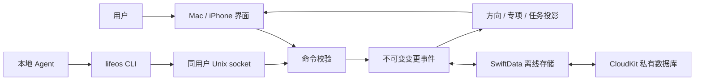

# 架构

## 事项结构

方向是 `kind=direction` 的记录；专项沿用 `kind=list`，通过 `directionID` 归属方向。任务通过 `listID` 归属专项，通过 `parentID` 表示父子关系。`inbox` 是待整理任务的专项标识。新增任务不强制日期。

命令层负责校验父子关系、跨专项移动、循环、排序、重复、模板和回收站等规则。移动父任务到另一个专项时，后代一起移动。手动排序只在同级任务间进行，父任务保留完整子树。

## 数据与同步

每次写入创建 `ChangeEvent`。事件投影重建当前记录；不同字段的并发修改合并，同一字段按逻辑时钟、设备标识与事件 ID 排序。SwiftData 持久化事件，CloudKit 私有数据库负责跨设备传输。

CLI 请求保存成功与云端同步完成是不同状态。离线时可继续本机编辑；同步错误在 App 设置中查看。失败的云数据库不会被自动替换成一个空的本地数据库。

撤回检查本机已知的后续修改；它不能预知另一台离线设备尚未上传的编辑。终止标记使清空回收站的对象不会因旧端同步或导入旧备份重新出现，但不等于物理擦除所有历史副本。

## 本地 Agent 接口

Mac App 使用 Unix domain socket，目录权限 0700，socket 权限 0600，连接双方核验同一系统用户。接口不监听 TCP/互联网端口，不接受远程 Agent 连接。所有请求在 App 中执行，不允许 CLI 绕过规则直接改数据库。

请求和响应上限为 1 MB，I/O 超时 15 秒。历史支持分页；任务查询暂不支持分页，大项目应使用专项、标签或搜索过滤。一个可信的本地 Agent 获得连接后可读写全部任务；当前没有针对单个 Agent 的细粒度授权。

## 修改入口

- 事项与规则：`Models.swift`、`Commands.swift`、`AdvancedCommands.swift`、`Structure.swift`。
- 层级导航和排序：`TaskNavigation.swift`、`TaskReordering.swift`、`App/TaskReorderInteraction.swift`。
- 持久化与同步状态：`App/DaylineStore.swift`。
- Agent 连接：`App/AgentServer.swift`、`LocalTransport.swift`、`Sources/DaylineCLI/main.swift`。
- 界面：`RootView.swift`、`TaskEditor.swift`、`StructureViews.swift`。
- Apple 标识：`Config/Shared.xcconfig`、个人 `Local.xcconfig` 与 `AppConfiguration.swift`。

内部 `Dayline` 类型名并不决定公开产品名。修改已经投入使用的 App 标识或数据目录会影响本机数据位置和同步；Fork 的全新安装与旧版本迁移应分别验证。
